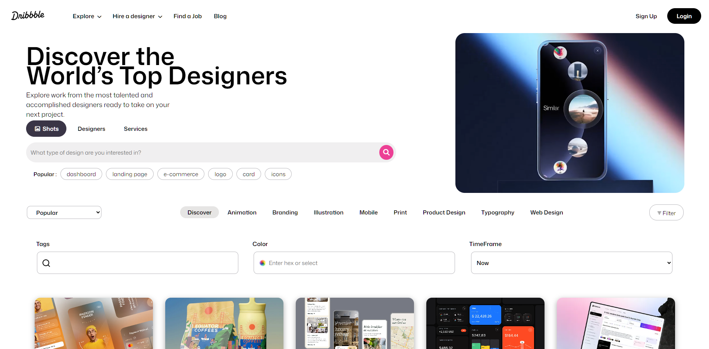

# 🎨 Dribbble Clone — HTML & CSS Learning Milestone

> A responsive **Dribbble homepage clone** built using **pure HTML and CSS**, created at the end of my first learning phase in front-end development.
> This project represents my 20-day journey of understanding web structure, layout systems, and visual styling.

---

---
## 🧩 Overview

This was my **finishing project** for HTML & CSS — a personal challenge to recreate the Dribbble homepage using only front-end fundamentals.
I focused on structure, alignment, spacing, and making it visually close to the real design.

I intentionally didn’t include dropdowns or interactivity because I wanted to move forward to learning **JavaScript**, and not spend too much time trying to force complex behaviors with only CSS.

---

## 🛠️ Tech Stack

| Technology               | Purpose                             |
| ------------------------ | ----------------------------------- |
| **HTML5**                | Page structure and content          |
| **CSS3**                 | Styling, layout, and responsiveness |
| **Flexbox & Grid**       | Page and card alignment             |
| **Media Queries**        | Responsive breakpoints              |
| **Custom Fonts & Icons** | Typography and UI consistency       |

---

## 📂 Folder Structure

```
DribbleClone/
│
├── index.html                  # Main HTML file
├── style.css                   # Complete styling
├── Webp/                       # Gallery and hero images
├── video/                      # Hero and background videos
├── Dribble_project_pics/       # UI icons and elements
└── Mona_Sans/                  # Custom font family
```

---

## ✨ Features

* Clean and minimal homepage layout
* Smooth transitions and hover effects
* Responsive design up to **max-width: 480px** (mobile view)
* Organized navigation bar, hero section, and gallery grid
* Custom icons, typography, and layered gradients

---

## ✅ Pros (What Went Well)

* Well-structured HTML with readable class names
* Strong understanding of **Flexbox** and **Grid** fundamentals
* Consistent spacing, alignment, and overall layout quality
* CSS transitions and animations that add visual depth
* Fully responsive down to the **480px breakpoint**

---

## ⚠️ Cons (What Could Be Better)

* I couldn’t fully understand some advanced flex properties (like `flex: 1 1 0`),
  so parts of the layout aren’t perfectly responsive at all widths.
* Dropdowns and interactivity weren’t implemented — by choice —
  since I wanted to move ahead and learn **JavaScript** for that.

---

## 🧠 What I Learned

* How to structure and style a realistic landing page using HTML & CSS only
* The difference between using **Flexbox** vs **Grid** effectively
* Managing fonts, icons, and assets professionally
* Writing cleaner, reusable CSS classes
* Understanding breakpoints and mobile-first thinking

---

## 🚀 How to Run

Method 1:

This is officially deployed and you can access it (or view that) by clicking on that link 🔗 
<a href="dribbleclone-two.vercel.app">dribbleclone-two.vercel.app</a>

Method 2:

if you want to clone that repository to your local system you can follow this method

1. Clone this repository:

   ```bash
   git clone https://github.com/hanzlafullstack/DribbleClone.git
   ```
2. Open the folder:

   ```bash
   cd DribbleClone
   ```
3. Launch `index.html` in your browser to preview the clone.

---

### 📜 License

This project is for **learning and personal use** only.
All images and icons belong to their respective owners (Dribbble & contributors).
